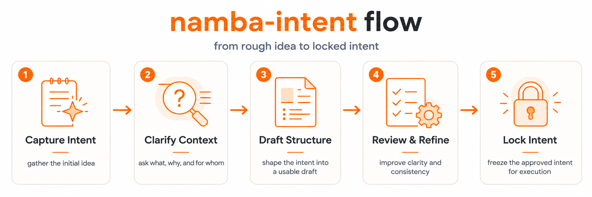

# namba-intent

<p align="center">
  <a href="README.md" aria-label="Read in English"></a>
  <a href="README.ko.md" aria-label="Read in Korean"></a>
</p>

<p align="center">
  <a href="LICENSE"></a>
  <a href=".github/workflows/ci.yml"></a>
  <a href="SECURITY.md"></a>
  <a href="docs/00_START_HERE.md"></a>
</p>

**Agent를 아직 실행하지 마세요. 먼저 intent를 compile하세요.**

namba-intent는 AI agent를 위한 Project Intent Compiler입니다.

namba-intent는 흐릿한 프로젝트 의도를 검토 가능한 구조로 정리하고,
downstream 작업 전에 잠긴 intent로 고정하는 도구입니다.

v0.6.4는 current published namba-intent release입니다. Primary command는
`namba-intent`이고, legacy `ni` command는 deprecated shim only입니다.

## Workflow



- 의도 포착: 거친 목표, 사용자, 제약, 위험, 막힌 점을 모읍니다.
- 맥락 정리: 흐릿하거나 빠진 맥락을 명확한 planning 질문으로 바꿉니다.
- 구조 초안화: intent를 문서와 machine-readable contract로 정리합니다.
- 검토와 정제: status proof와 사용자 검토로 계획을 다듬습니다.
- 의도 잠금: downstream 작업 전에 승인된 intent를 잠급니다.

## Why namba-intent

AI agents는 빠릅니다. namba-intent는 implementation 전에 프로젝트 의미를
결정하는 느려야 하는 부분만 느리게 만듭니다.

- 누락된 users, acceptance criteria, risks, non-goals, blockers를 포착합니다.
- Deterministic CLI rules로 planning readiness를 확인합니다.
- Accepted plan을 lock하고 trusted planning sources를 hash합니다.
- Downstream actors를 위한 짧은 prompt를 compile하되 실행하지 않습니다.

## Install

README는 current tree의 첫 성공을 위한 두 가지 primary path만 보여줍니다.
Source, local build, release archive, pinned installs, dry-run, inspect-first,
`BINDIR`, uninstall details, v0.5.1 public-release distinction은
[Install namba-intent](docs/22_INSTALL.md)에 있습니다.

### macOS

최신 namba-intent release는 curl installer로 설치합니다.

```bash
curl -fsSL https://raw.githubusercontent.com/Nam-Cheol/ni/main/install.sh | sh -s -- --update-path
```

설치 후 새 shell을 열고 command를 확인합니다.

```bash
namba-intent --help
namba-intent version
```

Homebrew: Planned / v0.5 candidate.

### Windows

PowerShell installer는 `namba-intent.exe`를 기본
`%LOCALAPPDATA%\namba-intent\bin`에 설치하고 User PATH만 업데이트하도록
configured되어 있습니다. Windows real-host verification은 Windows transcript가
생길 때까지 pending입니다.

```powershell
$Installer = Join-Path $env:TEMP "namba-intent-install.ps1"
irm https://raw.githubusercontent.com/Nam-Cheol/ni/main/install.ps1 -OutFile $Installer
powershell -NoProfile -ExecutionPolicy Bypass -File $Installer
```

새 PowerShell session을 열고 확인합니다.

```powershell
namba-intent --help
namba-intent version
```

`ni -> New-Item` PowerShell alias cleanup은 legacy v0.5.x guidance이며
`namba-intent.exe`에는 필요하지 않습니다. 실제 Windows host execution은
Windows transcript가 생기기 전까지 deferred입니다.

## 5분 첫 project

```bash
mkdir my-project
cd my-project
namba-intent init .
namba-intent status --proof --next-questions
namba-intent end
namba-intent run --max-chars 4000
```

`namba-intent init .`은 guided setup을 열고 `.ni/contract.json`,
`.ni/session.json`, `docs/plan/**`을 만듭니다. 첫 답변은 거칠거나
불완전해도 됩니다. 부족한 점은 `status`로 확인하세요. namba-intent는
compatibility를 위해 `.ni/`를 유지합니다.

`namba-intent status --proof --next-questions`는 CLI-authoritative readiness
gate입니다. Model이나 skill은 docs draft와 next question 답변을 도울 수
있지만 readiness는 CLI가 결정합니다.

`namba-intent end`는 CLI gate가 허용한 뒤 accepted plan을 lock하고
사용자가 plan에 동의했을 때만 `.ni/plan.lock.json`을 씁니다.

`namba-intent run --max-chars 4000`은 bounded downstream handoff prompt를
compile합니다. Prompt, agents, shell commands를 실행하지 않고 product
readiness를 증명하지 않습니다.

Model assistance는 선택 사항입니다. AI assistant에게 `docs/plan/**`,
`.ni/contract.json`, `.ni/session.json`을 읽고 plan을 다듬도록 요청할 수
있습니다. Skills are UX; CLI is authority.

## What namba-intent Does

| Command | Role |
| --- | --- |
| `namba-intent init .` | Planning workspace와 guided intent draft를 만듭니다. |
| `namba-intent status --proof --next-questions` | Readiness, blockers, next planning questions를 확인합니다. |
| `namba-intent end` | CLI gate를 통해 accepted plan을 lock합니다. |
| `namba-intent run --max-chars 4000` | Valid lock에서 bounded prompt를 compile합니다. |

## What namba-intent Does Not Do

namba-intent는 task runner, SPEC runner, multi-agent execution layer, queue,
shell adapter, PR automation system, release automation system, downstream
execution runtime이 아닙니다.

## Status

- v0.5.1 publication: historical `ni` command 기준 verified.
- v0.6.4 release: macOS darwin/arm64에서 `namba-intent` 기준 published and verified.
- Primary command: `namba-intent`.
- Deprecated transition shim: `ni`는 `ni is deprecated; use namba-intent.`를 warning합니다.
- Repository: `Nam-Cheol/ni` retained.
- Config directory: `.ni/` retained.
- Homebrew: Planned / v0.5 candidate.
- Windows real-host execution: Windows transcript 전까지 deferred.
- Model workspace packs: Experimental. Host-level/global install은 documented 전까지 unverified입니다.
- No-terminal method: Experimental / assisted.
- Skills are UX; CLI is authority.

## 다음에 읽을 것

| Read | Why |
| --- | --- |
| [Install namba-intent](docs/22_INSTALL.md) | 상세 install, release binary, curl installer, uninstall paths. |
| [Rename implementation](docs/136_NAMBA_INTENT_RENAME_IMPLEMENTATION.md) | v0.6.0 command rename surfaces와 claim boundaries. |
| [Intent Lock Protocol](docs/42_INTENT_LOCK_PROTOCOL.md) | Readiness, locking, hash trust, blocked handoff rules. |
| [No-Terminal Planning](docs/no-terminal.md) | Assisted workflow boundaries; deterministic validation 아님. |
| [Model Workspace Status](docs/99_MODEL_WORKSPACE_STATUS.md) | Experimental model workspace boundaries와 verification state. |

License: namba-intent는 [MIT License](LICENSE)로 배포됩니다.
