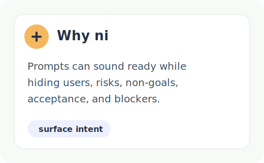
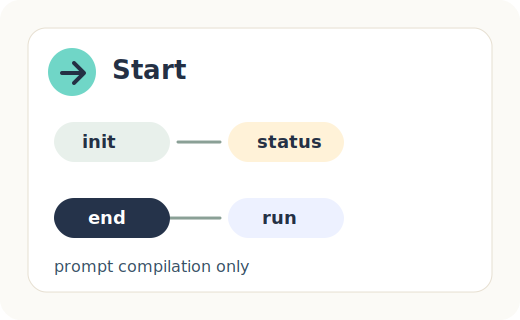
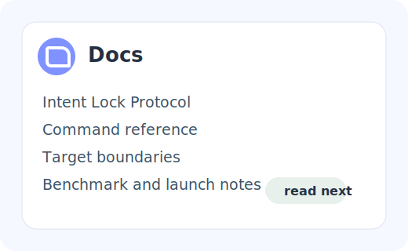

<p align="center">
  
</p>

<h1 align="center">agent를 아직 실행하지 마라. 먼저 의도를 컴파일하라.</h1>

<p align="center"><strong>ni는 AI agents나 teams가 work를 시작하기 전에 planning conversation을 locked project contract로 바꾼다.</strong></p>

<p align="center">
  <a href="README.md"><kbd>English</kbd></a>
  <a href="README.ko.md"><kbd>한국어</kbd></a>
</p>

<p align="center">
  <a href=".github/workflows/ci.yml"></a>
  <a href="docs/22_INSTALL.md"></a>
  <a href="LICENSE"></a>
  <a href="docs/42_INTENT_LOCK_PROTOCOL.md"></a>
</p>

<p align="center">
  <a href="#why-ni"></a>
  <a href="#60초-시작"></a>
  <a href="#다음에-읽을-것"></a>
</p>

## Why ni

Agents는 code ability 부족보다 unclear intent 때문에 더 자주 실패한다.

`ni`는 Project Intent Compiler다. Execution이 시작되기 전, vague goals가 hidden
assumptions로 바뀌는 지점에 선다:

```text
planning conversation -> explicit contract -> readiness gate -> locked plan -> bounded prompt or seed
```

1. AI agents는 너무 일찍 실행된다.
2. `ni`는 ambiguous execution을 block한다.
3. `ni`는 intent를 locked project contract로 compile한다.
4. 그 뒤 humans, models, tools가 그 contract를 기준으로 work할 수 있다.

Payoff: `ni`는 unclear intent를 visible하게 만들고, unsafe handoff를 block하며,
locked plan에서 bounded prompt 또는 seed를 만든다.

## 60초 시작

`ni`는 현재 source-first다. Repository를 checkout한 뒤 실행한다:

```bash
go run ./cmd/ni --help
go run ./cmd/ni init --dir ./my-plan --profile prototype
go run ./cmd/ni status --dir ./my-plan
```

이제 conversation으로 `./my-plan/docs/plan/**`과
`./my-plan/.ni/contract.json`을 채운다. Readiness authority는 model이 아니라
CLI다:

```bash
go run ./cmd/ni status --dir ./my-plan --next-questions
go run ./cmd/ni end --dir ./my-plan
go run ./cmd/ni run --dir ./my-plan --target generic --max-chars 4000
```

`ni run`은 prompt를 compile한다. Shell commands, queues, agents, downstream
work를 실행하지 않는다.

## Install and use

| Path | Status | Meaning |
| --- | --- | --- |
| Source mode | Available | 개발하거나 kernel을 시험할 때 `go run ./cmd/ni ...`로 실행한다. Go가 필요하다. |
| Local binary | Available | `make build`로 build한 뒤 `./bin/ni ...`를 실행한다. Build step에는 Go가 필요하다. |
| Local install | Available | `make install-local`로 local bin path에 install한다. Build step에는 Go가 필요하다. |
| Release binary mode | Prepared, not yet available | Future GitHub Releases를 위한 GoReleaser pipeline은 configured 상태지만, 첫 release assets가 publish되기 전까지 binaries는 available하지 않다. |
| Curl installer mode | Planned | `install.sh`는 아직 없으며 verified release assets 이후에만 가능하다. |
| Package manager mode | Planned | Homebrew와 Scoop packages는 아직 publish되지 않았다. |
| Model workspace mode | Available in repo-local form | Codex/Claude-style skills는 plan authoring을 도울 수 있지만 CLI가 계속 authority다. Portable packs는 planned다. |
| No-terminal mode | Planned | Downloadable model pack과 docs-first workflow는 아직 available하지 않다. |

지원되는 local path는 [Install ni](docs/22_INSTALL.md)를 참고하라. Planned adoption
tracks는 [Distribution Strategy](docs/53_DISTRIBUTION_STRATEGY.ko.md)를 참고하라.
Distribution automation은 repository infrastructure이지 `ni` runtime execution이
아니다.

이 README는 package distribution이나 published binary release를 claim하지 않는다.
GitHub Release가 verified release assets를 실제로 포함하기 전까지는 source, local build, local install mode를 사용한다.

## Locked되는 것

Kernel은 pre-runtime control layer를 소유한다:

- `docs/plan/**` planning docs;
- `.ni/contract.json`;
- `ni status`의 deterministic readiness;
- `.ni/plan.lock.json`;
- `ni run`의 bounded prompt compilation.

Lock이 생긴 뒤에는 lockfile이 source of truth다. Current plan이 locked hashes와
더 이상 일치하지 않으면 handoff는 `BLOCKED`로 멈춘다.

## ni가 아닌 것

`ni`는 task runner, spec runner, multi-agent execution layer, queue, shell
adapter, PR automation system, release automation system, downstream work
runtime이 아니다. Seed material은 derived and mutable이며, locked plan이
authority다.

## 다음에 읽을 것

| Read | Why |
| --- | --- |
| [Why ni](docs/why-ni.md) | Product argument와 positioning. |
| [Intent Lock Protocol](docs/42_INTENT_LOCK_PROTOCOL.md) | Readiness, locking, hash trust, blocked handoff 규칙. |
| [Command reference](docs/commands.ko.md) | Implemented CLI surface. |
| [Ambiguous Prompt Blocked](examples/ambiguous-prompt-blocked/) | Vague intent가 execution을 올바르게 멈추는 small demo. |

## License

`ni`는 [MIT License](LICENSE)로 licensed된다.

Security policy와 reporting scope는 [SECURITY.md](SECURITY.md)에 문서화되어 있다.
