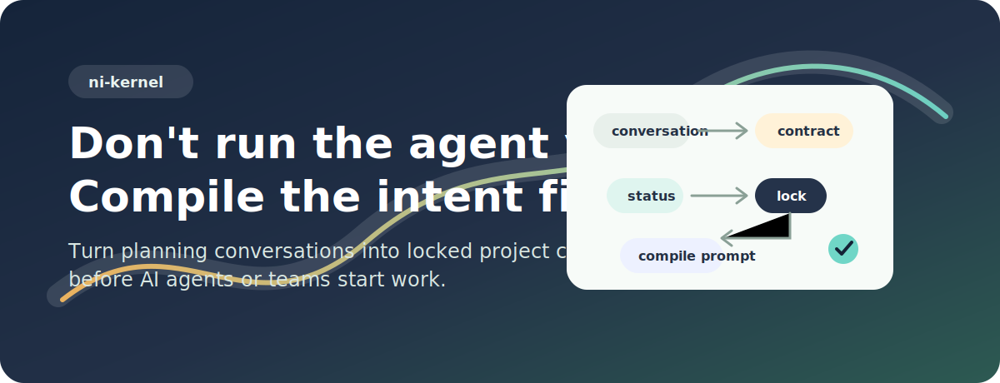
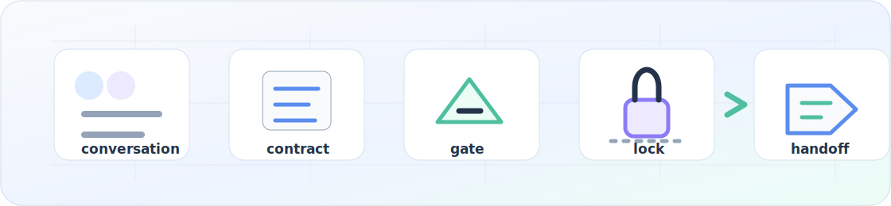

<p align="center">
  
</p>

<p align="center">
  <a href="README.md" aria-label="Read in English"></a>
  <a href="README.ko.md" aria-label="Read in Korean"></a>
</p>

<p align="center">
  <a href="LICENSE"></a>
  <a href=".github/workflows/ci.yml"></a>
  <a href="SECURITY.md"></a>
  <a href="docs/00_START_HERE.md"></a>
</p>

<h1 align="center">Don't run the agent yet. Compile the intent first.</h1>

<p align="center"><strong>ni is a Project Intent Compiler for AI Agents.</strong></p>

`ni` turns a planning conversation into a docs contract, checks readiness,
locks the accepted plan, and compiles a bounded downstream handoff prompt.

<p align="center">
  
</p>

## Why ni

AI agents move fast. `ni` slows down only the part that should be slow:
deciding what the project actually means before implementation starts.

- Capture missing users, acceptance criteria, risks, non-goals, and blockers.
- Check planning readiness with deterministic CLI rules.
- Lock the accepted plan and hash the trusted planning sources.
- Compile a short prompt for downstream actors without executing it.

## Install

README shows two primary first-success paths. Source, local build, Linux,
release-archive, pinned installs, dry-run, inspect-first, `BINDIR`, and
advanced uninstall details live in
[Install ni](docs/22_INSTALL.md).

### macOS

Install the latest release binary with the curl installer:

```bash
curl -fsSL https://raw.githubusercontent.com/Nam-Cheol/ni/main/install.sh | sh -s -- --update-path
```

Open a new shell, then verify the global command:

```bash
ni --help
ni version
```

Uninstall the installer-installed binary and the ni-managed PATH block, if one
was added:

```bash
curl -fsSL https://raw.githubusercontent.com/Nam-Cheol/ni/main/install.sh | sh -s -- --uninstall
```

Homebrew: Planned / v0.5 candidate.

### Windows

Install the latest release with the PowerShell installer, which installs to
`%LOCALAPPDATA%\ni\bin` by default and updates User PATH only:

```powershell
irm https://raw.githubusercontent.com/Nam-Cheol/ni/main/install.ps1 -OutFile install.ps1
.\install.ps1
```

Open a new PowerShell session, then verify the global command:

```powershell
ni --help
ni version
```

Uninstall the installer-installed binary and the User PATH entry added by `ni`:

```powershell
.\install.ps1 -Uninstall
```

Windows installer code and static safety checks are present. Real-host Windows
execution remains deferred on this macOS-only development host until a Windows
install transcript exists.

## First project in 5 minutes

Public install parity note: the published v0.5.1 binary verifies `ni --help`,
`ni version`, `ni init .`, and `ni status --proof --next-questions` on the
tested macOS arm64 path. The earlier v0.5.0 `ni init .` mismatch is closed for
that path; see [docs/132](docs/132_V0_5_1_POST_RELEASE_VERIFICATION.md).

```bash
mkdir my-project
cd my-project
ni init .
ni status --proof --next-questions
ni end
ni run --max-chars 4000
```

`ni init .` opens a guided project intent wizard and creates
`.ni/contract.json`, `.ni/session.json`, and `docs/plan/**`.

`ni status --proof --next-questions` is the CLI-authoritative readiness gate.
A model can draft updates, but `ni status` decides readiness.

`ni end` locks the accepted plan and writes `.ni/plan.lock.json` only after the
CLI gate permits it.

`ni run --max-chars 4000` compiles a bounded downstream handoff prompt. It does
not execute the prompt, run agents, run shell commands, or prove product
readiness.

## What ni does

| Command | Role |
| --- | --- |
| `ni init .` | Create a planning workspace and guided intent draft. |
| `ni status --proof --next-questions` | Check readiness, blockers, and next planning questions. |
| `ni end` | Lock the accepted plan through the CLI gate. |
| `ni run --max-chars 4000` | Compile a bounded prompt from a valid lock. |

## What ni does not do

`ni` is not a task runner, SPEC runner, multi-agent execution layer, queue,
shell adapter, PR automation system, release automation system, or downstream
execution runtime.

## Status

- v0.5.1 publication: verified.
- Release binary: Available.
- Curl installer: Available.
- Homebrew: Planned / v0.5 candidate.
- Windows real-host execution: deferred until a Windows transcript exists.
- Model workspace packs: Experimental. Host-level/global install remains unverified unless documented.
- No-terminal method: Experimental / assisted.
- Skills are UX; CLI is authority.

## Read next

| Read | Why |
| --- | --- |
| [Install ni](docs/22_INSTALL.md) | Detailed install, release binary, curl installer, and uninstall paths. |
| [Intent Lock Protocol](docs/42_INTENT_LOCK_PROTOCOL.md) | Readiness, locking, hash trust, and blocked handoff rules. |
| [No-Terminal Planning](docs/no-terminal.md) | Assisted workflow boundaries; not deterministic validation. |
| [Model Workspace Status](docs/99_MODEL_WORKSPACE_STATUS.md) | Experimental model workspace boundaries and verification state. |
| [Benchmark Claim Boundaries](docs/97_BENCHMARK_CLAIM_BOUNDARIES.md) | What benchmark `READY`, `not_measured`, and prompt evidence do and do not prove. |
| [Command reference](docs/commands.md) | The implemented CLI surface. |

License: `ni` is licensed under the [MIT License](LICENSE).
