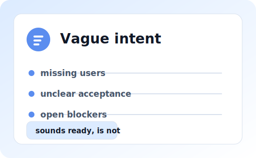
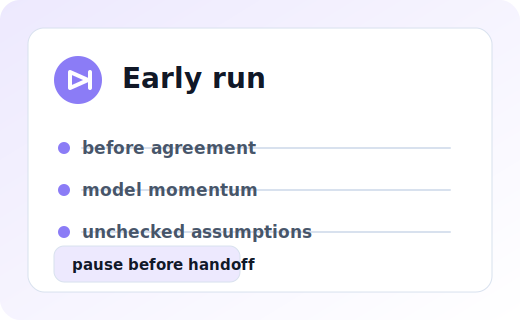
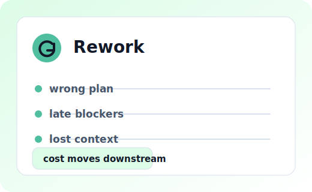
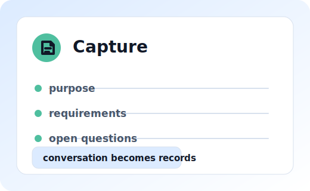
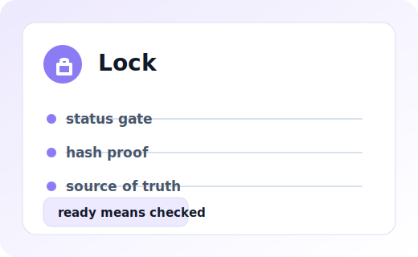
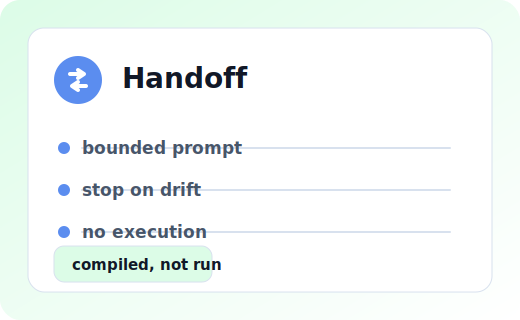

<p align="center">
  
</p>

<p align="center">
  <a href="README.md" aria-label="Read in English"></a>
  <a href="README.ko.md" aria-label="Read in Korean"></a>
</p>

<p align="center">
  <a href="LICENSE"></a>
  <a href=".github/workflows/ci.yml"></a>
  <a href="SECURITY.md"></a>
  <a href="docs/00_START_HERE.md"></a>
</p>

<h1 align="center">Don't run the agent yet. Compile the intent first.</h1>

<p align="center"><strong>ni turns planning conversations into locked project contracts before implementation work starts.</strong></p>

`ni` is a Project Intent Compiler for AI Agents. It makes intent explicit,
checks whether the plan is ready, locks the accepted contract, and compiles a
bounded handoff prompt or derived seed material.

## Why ni

<p align="center">
  
  
  
</p>

### Vague intent

A prompt can sound actionable while users, acceptance criteria, risks,
non-goals, or blocker questions are still missing.

### Early execution

Work should not begin just because a request sounds plausible.

### Rework

Hidden assumptions become expensive after people, models, or tools start from
the wrong plan.

## What ni gives you

<p align="center">
  
  
  
</p>

### Capture intent

Planning conversation becomes explicit docs and a contract draft.

### Lock contract

`ni status` and `ni end` gate readiness, hashes, and lock creation.

### Handoff safely

`ni run` compiles a bounded prompt or seed from a valid locked plan. It does not
execute shell commands, queues, agents, or downstream work.

## Start in 60 seconds

Start from source when you are evaluating or developing from this checkout:

```bash
go run ./cmd/ni --help
go run ./cmd/ni init --dir ./my-plan --profile prototype
go run ./cmd/ni status --dir ./my-plan
```

Use conversation to fill `./my-plan/docs/plan/**` and
`./my-plan/.ni/contract.json`, then let the CLI make the authoritative call:

```bash
go run ./cmd/ni status --dir ./my-plan --next-questions
go run ./cmd/ni end --dir ./my-plan
go run ./cmd/ni run --dir ./my-plan --target generic --max-chars 4000
```

## Choose your path

| Path | Status | Start with | Use it when |
| --- | --- | --- | --- |
| Source | Available | `go run ./cmd/ni --help` | You have Go and want the clearest development or evaluation path. |
| Local binary | Available | `make build && ./bin/ni --help` | You want `./bin/ni` or a local install from this checkout. |
| Release binary | Available | [v0.4.0 release](https://github.com/Nam-Cheol/ni/releases/tag/v0.4.0) | You want `ni` without Go and prefer manual checksum verification. |
| Curl installer | Available | `sh install.sh --dry-run --version 0.4.0` | You want a small shell installer after inspecting the script. |
| Model workspaces | Experimental | [Model Workspace Status](docs/99_MODEL_WORKSPACE_STATUS.md) | Use `ni-start`, `ni-grill`, `ni-end`, and `ni-run` guidance inside supported model workspaces. Skills are UX; the CLI is authority. Host-level/global install remains unverified unless documented. |
| No-terminal method | Experimental | [No-Terminal Planning](docs/no-terminal.md) | You want assisted docs and contract drafting before a trusted runner produces CLI proof; model judgment is not a lock. |
| Homebrew | Planned | [Homebrew Decision](docs/80_HOMEBREW_DECISION.md) | You prefer a package manager; implementation is deferred to v0.5 and no tap or formula is published or tested. |

### Which path should I choose?

Use Source if you have Go. Use Local binary if you want a repeatable binary
from this checkout. Use Release binary if you want no-Go installation with
manual checksum verification. Use Curl installer if you are comfortable
inspecting a shell script first. Use Model workspaces for model-assisted
planning, and No-terminal method only for assisted drafting until CLI proof
exists. Wait for Homebrew if you require package-manager installation.

Minimal curl installer check:

```bash
VERSION="0.4.0"
curl -fsSLO https://raw.githubusercontent.com/Nam-Cheol/ni/main/install.sh
sed -n '1,320p' install.sh
sh install.sh --dry-run --version "$VERSION"
```

For complete source, local binary, release binary, and curl installer steps,
see [Install ni](docs/22_INSTALL.md). For the manual release path, download
the matching archive and `ni_0.4.0_checksums.txt` from the same v0.4.0 release,
verify the archive checksum, extract it, and then run `ni --help` and
`ni version`.

Release status: v0.4.0 release binaries are available after asset and checksum
verification. The curl installer is available after verification against the
real v0.4.0 release assets. Package-manager distribution, including Homebrew,
is not available yet.

License: `ni` is licensed under the [MIT License](LICENSE).

See [Install ni](docs/22_INSTALL.md), [No-Terminal Planning](docs/no-terminal.md),
[Model Workspace Status](docs/99_MODEL_WORKSPACE_STATUS.md),
[Model Workspace Packs](docs/55_MODEL_WORKSPACE_PACKS.md), and
[Model Pack Install Verification](docs/75_MODEL_PACK_INSTALL_VERIFICATION.md)
for details.

## Demo

The best first demo is a blocked one:

```bash
go run ./cmd/ni status --dir examples/ambiguous-prompt-blocked/workspace
```

```text
BLOCKED
```

That result is the point. A vague request should stop before handoff. See the
[Ambiguous Prompt Blocked](examples/ambiguous-prompt-blocked/) walkthrough.

## What ni is not

`ni` is not a task runner, spec runner, multi-agent execution layer, queue,
shell adapter, PR automation system, release automation system, or runtime for
downstream work. The kernel owns planning contracts, readiness, lockfiles, hash
checks, and prompt compilation.

## Read next

| Read | Why |
| --- | --- |
| [Why ni exists](docs/product-story.md) | The short product story behind compile-before-run. |
| [Intent Lock Protocol](docs/42_INTENT_LOCK_PROTOCOL.md) | The deeper rules for readiness, locking, hash trust, and blocked handoff. |
| [Install ni](docs/22_INSTALL.md) | Source, local build, release binary, and curl installer details. |
| [Benchmark Claim Boundaries](docs/97_BENCHMARK_CLAIM_BOUNDARIES.md) | What benchmark `READY`, `not_measured`, and 4000-character prompt evidence do and do not prove. |
| [Homebrew Decision](docs/80_HOMEBREW_DECISION.md) | Homebrew remains Planned; tap implementation is deferred to v0.5. |
| [Homebrew Tap Plan](docs/72_HOMEBREW_TAP_PLAN.md) | Planned Homebrew route; no package-manager availability claim. |
| [Command reference](docs/commands.md) | The implemented CLI surface. |
| [README Visual Wireframe](docs/63_README_VISUAL_WIREFRAME.md) | The visual layout contract for this README. |
